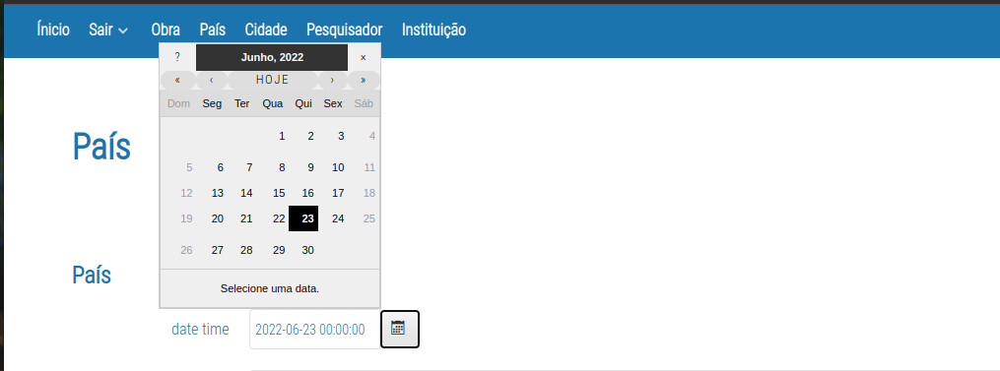
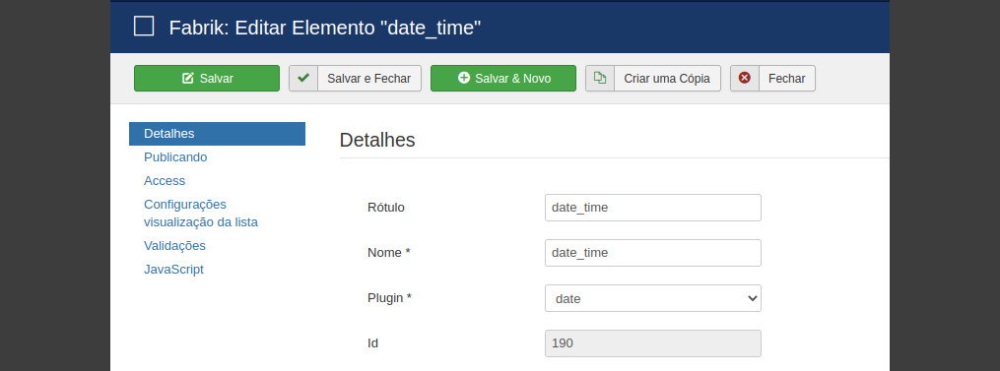
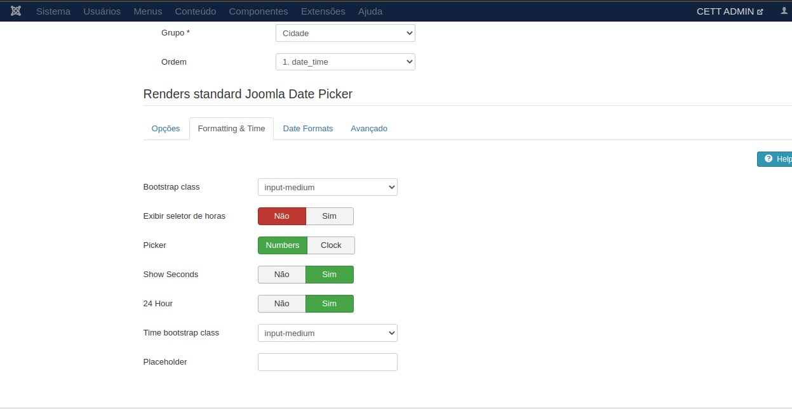
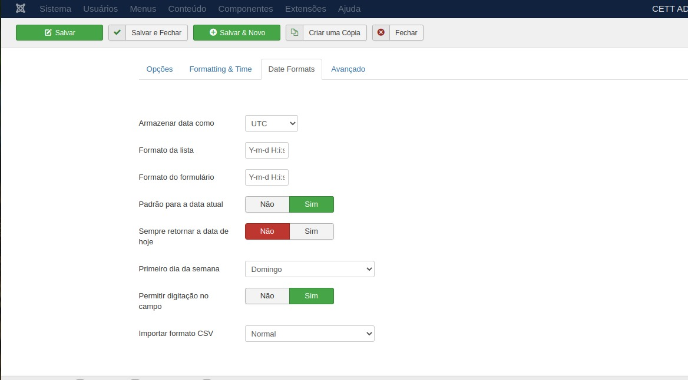
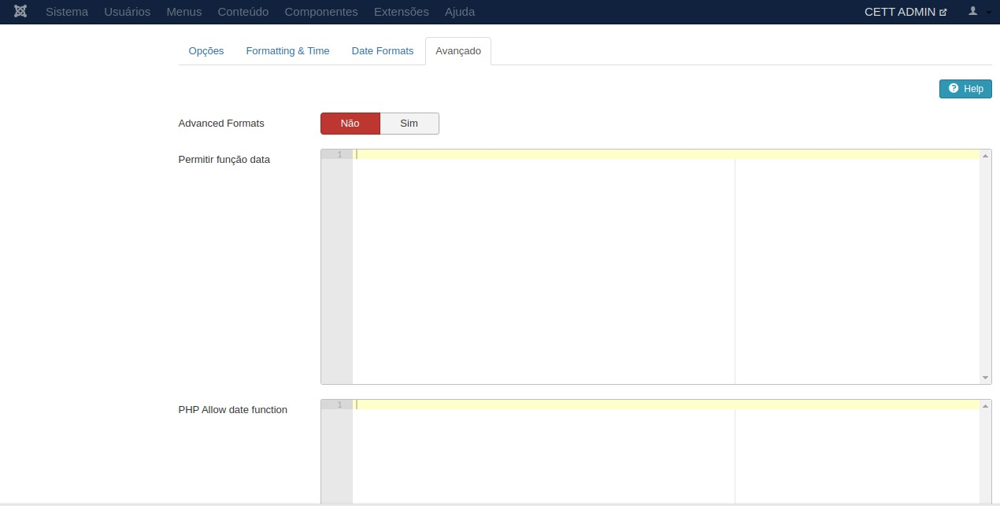

# Plugin Date-Master

 

## Conteudo

- [Sobre](#sobre)
- [Uso](#uso)
- [Customização](#customizacao)

## Sobre

O plugin Date Master, surge da possibilidade de customizar o campo DATA em formularios e elementos do fabrick. Permite uma customização e padronização que será de extrema eficiência na inserção das informações do campo "date" no banco de dados.

    

# Uso

Com o plugin devidamente instalado no Joomla, acesso o joomla e escolha o elemento que deseja inserir este plugin. 

<b>OBS.:</b> Geralmente este plugin é utilizado em campos onde a data precisa ser informada e inserida. Data de evento, Aniversário e etc... 

    

# Customização
Você pode adicionar uma formatação para o campo data.
Abaixo temos alguns exemplos para esta formatação.

    

    

Neste campo poderá ser adicionado algun script em php ou javascript com uma formatação personalizada.

    

